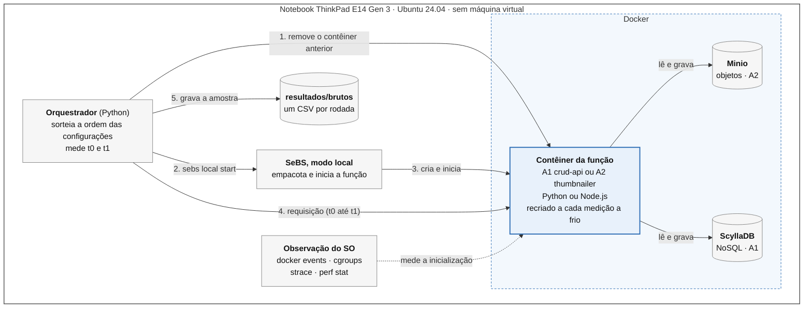

# Cold Start em Funções Serverless (Docker)

Plano experimental para medir o **cold start** de duas aplicações serverless reais do benchmark [SeBS](https://github.com/spcl/serverless-benchmarks), executadas em contêineres Docker no notebook do pesquisador.

Disciplina: Sistemas Operacionais, IFPB.

---

## Objetivo e escopo

O experimento mede quanto tempo extra o primeiro atendimento de uma função custa quando o ambiente precisa ser criado do zero (cold start).

Os resultados valem para essa plataforma local, **não** para o AWS Lambda ou outro provedor. Em troca, o ambiente é totalmente controlável e permite observar, com ferramentas do sistema operacional, onde o tempo é gasto na inicialização.

**Perguntas de pesquisa**

1. Como o runtime (Python ou Node.js) e o limite de memória do contêiner afetam o cold start?
2. Qual o efeito do tamanho do pacote e das dependências?
3. O modo de rede do Docker (bridge ou host) altera a latência de inicialização?
4. Quanto o estado do cache do sistema operacional (quente ou descartado) muda o resultado, em comparação com um contêiner já em execução?

---

## 1. Arquitetura do ambiente experimental

Todo o experimento roda em uma única máquina, o notebook do pesquisador, diretamente no Ubuntu e sem máquina virtual. Um script orquestrador controla cada medição: cria o contêiner da função, envia a requisição e registra os tempos.



- A função usa armazenamento local, também em contêineres: **Minio** (imagens da A2) e **ScyllaDB** (banco NoSQL do carrinho da A1).
- O SeBS, em modo local, empacota a função e inicia seu contêiner.
- O SeBS traz experimentos de cold start prontos, mas a função que força o cold start (`enforce_cold_start`) **não está implementada** no modo local. Por isso o orquestrador remove e recria o contêiner antes de cada medição a frio.
- O modo local do SeBS não configura limite de memória (há um comentário `FIXME: configure memory` em `sebs/local/local.py`) e fixa a rede em `bridge`. Os experimentos E1 e E3 dependem de um patch pequeno nessa função, guardado em `configs/`.
- O SeBS cria o contêiner como `privileged` e com `seccomp` liberado (necessário para acessar contadores de desempenho). Isso vale para todas as configurações, mas afasta o ambiente de uma plataforma serverless real.

---

## 2. Hardware e software

| Item | Especificação |
| --- | --- |
| Equipamento | Notebook Lenovo ThinkPad E14 Gen 3 |
| CPU | AMD Ryzen 5 5500U (6 núcleos, 12 threads) |
| Memória | 8 GB |
| Disco | SSD NVMe 256 GB |
| Sistema operacional | Ubuntu 24.04.5 LTS |

| Software | Uso |
| --- | --- |
| Docker (SeBS exige 19 ou superior) | Execução dos contêineres |
| Python 3.10 ou superior | SeBS e orquestrador |
| SeBS (spcl/serverless-benchmarks) | Aplicações e modo local |
| Minio e ScyllaDB (contêineres) | Armazenamento da A2 e da A1 |
| strace, perf, docker events | Análise do que acontece na inicialização |
| Pandas, SciPy, Matplotlib | Análise estatística e gráficos |

Antes de cada rodada, o governador da CPU é fixado em modo `performance` e os demais programas são encerrados. As versões do kernel, do Docker e do SeBS (commit) são registradas em `docs/ambiente.md`.

**Cuidados por usar um notebook com 8 GB**

- Manter na tomada durante toda a coleta, pois na bateria a CPU reduz a frequência e os tempos mudam.
- Usar o Docker direto no host, não dentro da máquina virtual do VirtualBox (2 GB são insuficientes).
- Registrar a temperatura e a frequência da CPU durante as rodadas (`sensors` e `cpupower`), porque notebooks reduzem a frequência por aquecimento. Se houver queda, esperar o resfriamento entre rodadas.
- Acompanhar o uso de memória (`free -m`) com Minio, ScyllaDB e o contêiner da função ligados. Se houver uso de swap, os tempos ficam invalidados: reduzir a memória do ScyllaDB ou subir só o armazenamento necessário a cada experimento (A1 usa ScyllaDB; A2 usa Minio).
- Desligar atualizações automáticas, sincronizações e navegador durante a coleta.

---

## 3. Fatores e configurações comparados

Quatro experimentos, cada um variando um fator enquanto os demais ficam fixos: **26 configurações** no total.

| Exp. | Fator variado | Níveis | Fixos | Configs |
| --- | --- | --- | --- | --- |
| E1 | Runtime × limite de memória | Python, Node.js × 128, 256, 512, 1024 MB | A1, rede bridge, cache quente | 8 |
| E2 | Tamanho do pacote | Mínimo, padrão do SeBS, ampliado; Python e Node.js | A2, 256 MB, bridge, cache quente | 6 |
| E3 | Modo de rede do Docker | bridge, host; Python e Node.js | A1, 256 MB, cache quente | 4 |
| E4 | Estado do cache do sistema | Cache quente, cache descartado; A1 e A2; Python e Node.js | 256 MB, bridge | 8 |

Em todas as configurações também são medidas invocações quentes (contêiner já em execução), que servem de referência. Os níveis de pacote de E2 serão definidos no piloto, depois de inspecionar o tamanho dos pacotes reais.

> Achado: o SeBS local não aplica limite de memória nem permite trocar o modo de rede. Para E1 e E3, o orquestrador usa uma versão do SeBS com um patch em `sebs/local/local.py` (parâmetros `mem_limit` e `network_mode` ao criar o contêiner). O limite de memória do Docker não aumenta a CPU disponível, ao contrário do Lambda, então o efeito esperado de E1 é menor do que na nuvem.

---

## 4. Workloads (cargas de trabalho)

| ID | Aplicação | O que faz | Armazenamento | Linguagens |
| --- | --- | --- | --- | --- |
| A1 | `130.crud-api` | Carrinho de compras: adiciona item (`PUT /cart`), busca item (`GET /cart/{id}`) e lista o carrinho com total e preço médio (`GET /cart`) | NoSQL (ScyllaDB) | Python, Node.js |
| A2 | `210.thumbnailer` | Baixa uma imagem JPEG do armazenamento, reduz para 200×200 e grava a miniatura | Objetos (Minio) | Python, Node.js |

- **A1:** a entrada é o tamanho `small` (lista o carrinho, com 4 itens pré-carregados). O tamanho `large` (5 inserções e 5 consultas) entra só em análise complementar.
- **A2:** a entrada é a imagem fixa do próprio SeBS, para que todas as medições façam o mesmo trabalho.
- Opcionalmente, o microbenchmark `010.sleep` do SeBS serve de controle para estimar o piso de latência da plataforma.

---

## 5. Métricas

A métrica principal é a **sobrecarga do cold start**: quanto a primeira requisição a um contêiner novo demora a mais que uma requisição a um contêiner já em execução.

| Métrica | Definição | Como é obtida |
| --- | --- | --- |
| Latência fim a fim (ms) | Do envio da requisição ao recebimento da resposta | Orquestrador, relógio monotônico |
| Sobrecarga do cold start (ms) | Latência a frio menos a mediana da latência quente da mesma configuração | Calculada |
| Tempo de criação do contêiner (ms) | Do comando de criação até o contêiner aceitar requisições | Orquestrador e `docker events` |
| Tempo de execução da função (ms) | Duração do handler; na A2, separa download, processamento e upload | Medição interna do SeBS (A2) ou instrumentação própria (A1) |
| Memória do contêiner (MB) | Uso de memória durante a execução | Medição de memória do SeBS local e cgroups |
| Chamadas de sistema e page faults | Onde o SO gasta tempo na inicialização | `strace -c` e `perf stat`, em amostra menor |

Para cada métrica: média, mediana, desvio padrão, intervalo interquartil e percentis p95 e p99, pois latências costumam ter distribuição assimétrica.

---

## 6. Ferramentas de medição

- Orquestrador em Python, com `time.perf_counter_ns` para a latência fim a fim e gravação de cada amostra em CSV.
- SeBS (modo local) para iniciar a função e o armazenamento, e para a medição de memória dos contêineres.
- Docker CLI e `docker events` para os instantes de criação e início do contêiner.
- `strace` e `perf stat` para contar chamadas de sistema e page faults durante a inicialização, em uma amostra.
- Arquivos de cgroup do contêiner para uso de CPU e memória.
- `echo 3 > /proc/sys/vm/drop_caches` para descartar o cache de páginas (E4) e `cpupower` para fixar a frequência da CPU.
- Pandas, SciPy e Matplotlib para estatísticas, testes e gráficos.

---

## 7. Quantidade de repetições

| Item | Quantidade |
| --- | --- |
| Piloto | 5 cold starts por configuração |
| Cold starts por rodada | 30 por configuração |
| Rodadas | 3, em dias ou horários diferentes |
| Invocações quentes por rodada | 50 por configuração |
| Total de cold starts | 26 × 90 = **2.340** |

O tamanho 30 permite estimativas razoáveis de mediana e de intervalos de confiança. O número será ajustado depois do piloto, conforme a variância observada.

---

## 8. Procedimento experimental

Cada medição a frio parte de um contêiner novo criado a partir de uma imagem que já está no disco. A ordem das configurações é sorteada em cada rodada.

1. **Preparação:** instalar o SeBS e iniciar Minio e ScyllaDB (`sebs storage start`), gerar as entradas, fixar a CPU em modo `performance` e registrar as versões de kernel, Docker e SeBS.
2. **Piloto:** 5 cold starts por configuração, para validar o pipeline, estimar a variância e conferir que o contêiner anterior é de fato removido.
3. **Sorteio:** embaralhar a ordem das configurações da rodada e intercalar medições de configurações diferentes, para que o horário não se confunda com o efeito dos fatores.
4. **Estado inicial (cold):** remover o contêiner anterior; no E4 com cache descartado, executar `drop_caches` logo antes.
5. **Medição a frio:** registrar t0, criar o contêiner, esperar a função responder, enviar a requisição, registrar t1 e coletar as medidas internas. O `sebs local start` também prepara a entrada e verifica o pacote; se o teste inicial mostrar que isso entra no tempo medido, o contêiner será criado direto pelo Docker, com a mesma imagem e os mesmos parâmetros do SeBS.
6. **Medição quente:** com o contêiner já em execução, enviar 50 requisições em sequência para obter a linha de base.
7. **Intervalo:** remover o contêiner e esperar alguns segundos antes da próxima medição.
8. **Registro:** gravar cada amostra em CSV bruto, sem sobrescrever, com configuração, rodada, índice e carimbo de tempo.
9. **Descarte:** amostras com erro, ou em que o contêiner não era realmente novo, são marcadas como falhas e repetidas; o total de descartes é reportado.
10. **Análise:** estatísticas descritivas, testes não paramétricos (Mann–Whitney e Kruskal–Wallis), intervalos de confiança por bootstrap e gráficos (boxplots e distribuições acumuladas).

---

## Limitações e ameaças à validade

- **Plataforma local:** os resultados valem para contêineres Docker neste notebook, não para um provedor de nuvem.
- **Contêiner privilegiado:** o SeBS usa `privileged` e `seccomp` liberado em todas as configurações, o que afasta o ambiente de uma plataforma serverless real.
- **Memória sem CPU:** o limite de memória do Docker não aumenta a CPU disponível, então o efeito de E1 pode ser pequeno.
- **Patch no SeBS:** E1 e E3 usam uma alteração local de `local.py`; o commit base e o patch ficam registrados.
- **Notebook:** a frequência da CPU pode variar com a temperatura, e 8 GB de RAM deixam pouca folga. Mitigação: tomada, governador `performance` e registro de temperatura, frequência e swap em cada rodada.
- **Cache do sistema:** fora do E4, as medições usam cache quente; o E4 mede a diferença.
- **O que o tempo inclui:** o tempo medido pode incluir trabalho além da criação do contêiner, dependendo de como o orquestrador for implementado (ver passo 5 do procedimento).

---

## Pontos a validar com o professor

- Uma plataforma local em contêineres Docker, em vez de um serviço de nuvem, atende ao trabalho? A alternativa é o OpenWhisk em Kubernetes (`kind`), mais pesado de montar.
- As aplicações do SeBS (CRUD API e Thumbnailer) são aceitas como cargas realmente usadas em serverless?
- 26 configurações e 90 cold starts por configuração são um tamanho adequado?
- A definição de cold start (contêiner novo, com a imagem já no disco) é suficiente, ou deve incluir também o download da imagem?
- O SeBS local não configura memória nem rede (FIXME no código). Aplicar um patch pequeno ao SeBS para os experimentos E1 e E3 é aceitável?

---

## Estrutura sugerida do repositório

```
.
├── README.md              # este plano
├── docs/                  # registro do ambiente (ambiente.md)
├── orquestrador/          # script que cria o contêiner, mede e grava os CSVs
├── benchmarks/            # cópia ou submódulo das aplicações do SeBS usadas (130.crud-api, 210.thumbnailer)
├── configs/               # configuração do SeBS local, patch do local.py e dos experimentos E1 a E4
├── resultados/            # CSVs brutos (nunca sobrescritos)
├── analise/               # notebooks ou scripts de estatística e gráficos
└── latex/                 # texto do projeto (Introdução, Fundamentação, Metodologia)
```

## Referências

- SeBS: Serverless Benchmark Suite. <https://github.com/spcl/serverless-benchmarks>
- Copik et al. *SeBS: A Serverless Benchmark Suite for Function-as-a-Service Computing.* <https://arxiv.org/abs/2012.14132>
- Bhattacharya, A.; Wen, T. *Understanding and Remediating Cold Starts: An AWS Lambda Perspective.* AWS Compute Blog, 2025.