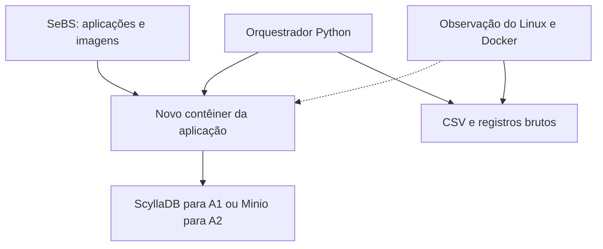

# Cold Start em Aplicações Serverless: Análise de Mecanismos de Sistema Operacional com Docker

**Integrantes:** Odilon Pontes e Matheus Yan  
**Disciplina:** Sistemas Operacionais, IFPB  
**Status:** plano experimental; procedimentos e configurações serão validados no estudo piloto.

Este projeto investiga a inicialização de aplicações do [Serverless Benchmark Suite (SeBS)](https://github.com/spcl/serverless-benchmarks) em contêineres Docker, executados localmente em Linux. O foco é relacionar a latência de cold start com criação de processos, carregamento de bibliotecas, gerenciamento de memória, page cache e acesso ao sistema de arquivos.

## Objetivo e escopo

Medir o tempo necessário para criar um novo ambiente de execução e obter a primeira resposta da aplicação, observando os mecanismos do Sistema Operacional associados a esse intervalo.

O experimento será realizado no notebook do pesquisador, com Docker diretamente sobre Linux e sem máquina virtual. As imagens estarão disponíveis localmente antes da coleta. Download de imagens, compilação, instalação de dependências e preparação das entradas ficarão fora da medição principal.

Os resultados caracterizarão esse ambiente local. Sua interpretação ficará limitada às aplicações, runtimes, hardware e configurações avaliados.

**Questão de pesquisa:** quais mecanismos de Sistema Operacional apresentam maior associação com a latência de cold start em aplicações executadas em novos contêineres Docker, e como essa associação varia entre runtimes e condições de execução?

**Perguntas específicas**

1. Como Python e Node.js se comportam sob diferentes limites de memória?
2. Como tamanho, organização e carregamento das dependências se relacionam com a inicialização?
3. Qual o efeito dos modos de rede `bridge` e `host`?
4. Como o estado do page cache se relaciona com latência, falhas de página e leituras?
5. Que padrões de criação de processos, mapeamento de bibliotecas e acesso a arquivos aparecem durante a inicialização?

**Hipótese de trabalho:** diferenças na preparação dos runtimes e no conjunto de arquivos e dependências efetivamente utilizados produzirão diferenças mensuráveis de inicialização. A comparação investigará essas diferenças sem estabelecer previamente uma ordenação de desempenho entre as linguagens.

## 1. Arquitetura do ambiente experimental

O orquestrador selecionará a configuração, preparará o estado inicial, removerá o contêiner anterior, criará o novo ambiente e registrará a primeira resposta. Os serviços auxiliares permanecerão ativos durante as medições da aplicação correspondente.



- **A1:** contêiner da função e ScyllaDB.
- **A2:** contêiner da função e Minio.
- **Medição principal:** relógio monotônico do orquestrador.
- **Observação do SO:** `docker events`, `strace`, `perf stat`, cgroups e interfaces de `/proc`.

### Integração com o SeBS

O README original identifica limitações do modo local relacionadas à imposição de cold start, limite de memória e modo de rede. Essas condições serão conferidas no **commit escolhido**, antes da coleta.

Se necessário, o orquestrador removerá e recriará diretamente o contêiner, preservando imagem, comando, variáveis de ambiente e volumes exigidos pelo SeBS. Alterações locais em `sebs/local/local.py` serão registradas em `configs/patches/`, incluindo a aplicação de `mem_limit` e `network_mode` quando ausentes.

O piloto verificará com `docker inspect` os limites realmente aplicados, a rede, o ID do contêiner e o processo principal. Também registrará as opções de privilégio, capabilities e seccomp utilizadas. As configurações serão mantidas constantes dentro de cada comparação.

## 2. Hardware e software

| Item | Ambiente planejado |
| --- | --- |
| Equipamento | Lenovo ThinkPad E14 Gen 3 |
| CPU | AMD Ryzen 5 5500U, 6 núcleos e 12 threads |
| Memória RAM | 8 GB |
| Armazenamento | SSD NVMe de 256 GB |
| Sistema operacional | Ubuntu 24.04.5 LTS, conforme informado no planejamento; confirmar no equipamento |
| Virtualização | Docker no Linux instalado diretamente no hardware |

| Componente | Finalidade |
| --- | --- |
| Docker | Criar, iniciar e remover os ambientes de execução |
| SeBS | Fornecer aplicações, entradas e integração local |
| Python | Implementar o orquestrador |
| Python e Node.js nas imagens | Executar implementações equivalentes das aplicações |
| ScyllaDB e Minio | Armazenamento auxiliar de A1 e A2 |
| `strace` | Registrar chamadas de sistema e arquivos referenciados |
| `perf stat` | Coletar contadores de desempenho disponíveis |
| `docker events` e `docker inspect` | Registrar ciclo de vida e configuração dos contêineres |
| cgroups e `/proc` | Observar CPU, memória, processos e I/O |
| `cpupower`, `sensors`, `free` e `vmstat` | Acompanhar as condições do host |
| Pandas, SciPy e Matplotlib | Processar dados, realizar análises e gerar gráficos |

Registrar em `docs/ambiente.md`: versão efetiva do Ubuntu, kernel, Docker, SeBS e seu commit, runtimes, bibliotecas, imagens e seus identificadores, driver de armazenamento, sistema de arquivos, versão de cgroups e políticas de CPU e swap. Requisitos de instalação serão conferidos na versão selecionada do SeBS.

## 3. Aplicações avaliadas

| ID | Aplicação | Carga de trabalho | Armazenamento | Runtimes planejados |
| --- | --- | --- | --- | --- |
| A1 | `130.crud-api` | Carrinho de compras: inserção, consulta e listagem de itens | ScyllaDB | Python e Node.js |
| A2 | `210.thumbnailer` | Obtenção de JPEG, redimensionamento para 200 × 200 pixels e gravação da miniatura | Minio | Python e Node.js |

- **A1:** utilizar a entrada `small` do SeBS, com o mesmo conteúdo do carrinho e a mesma operação em todas as repetições. Confirmar sua composição no commit utilizado.
- **A2:** utilizar a mesma imagem, identificada por hash, mantendo parâmetros de redimensionamento constantes. Definir a limpeza ou sobrescrita das saídas antes da coleta.
- Validar a disponibilidade e equivalência funcional das duas implementações no piloto. Java e Go poderão ser discutidos teoricamente ou utilizados em extensão futura, após a implementação de cargas equivalentes.
- O microbenchmark `010.sleep` poderá ser utilizado como controle complementar, sem integrar as 26 configurações principais.

A criação e inicialização de ScyllaDB e Minio ocorrerão antes da medição. Eventuais operações que alterem dados deverão ter uma política de restauração do estado inicial, executada fora do intervalo cronometrado.

## 4. Definição operacional e limites da medição

Uma **execução a frio** começará com um contêiner novo, criado a partir de uma imagem já armazenada no host. Uma **execução quente** utilizará o mesmo contêiner e processo da aplicação, previamente inicializados.

Criar um contêiner novo não descarta automaticamente o page cache do host. Assim, será possível observar um runtime recém-inicializado com os arquivos já presentes em cache.

| Estado da aplicação | Estado dos caches do host | Uso no experimento |
| --- | --- | --- |
| Novo contêiner e novo processo | Cache previamente aquecido | Cold start em E1, E2, E3 e condição quente de E4 |
| Novo contêiner e novo processo | Caches descartados antes da criação | Condição de descarte de E4 |
| Mesmo contêiner e processo | Estado resultante da execução anterior | Referência de invocação quente |

### Instantes registrados

| Instante | Evento |
| --- | --- |
| `t0` | Imediatamente antes da solicitação de criação do contêiner |
| `t_ready` | Aplicação sinaliza que está apta a atender |
| `t_req` | Envio da primeira requisição de trabalho |
| `t_resp` | Recebimento completo da primeira resposta |

As durações serão calculadas com `time.perf_counter_ns()` no orquestrador:

```text
T_cold_total = t_resp - t0
T_ready     = t_ready - t0
T_req_cold  = t_resp - t_req
T_warm      = resposta_quente - envio_quente
Overhead    = T_cold_total - mediana(T_warm da mesma configuração e rodada)
```

`T_cold_total` será a métrica principal. `T_req_cold` isoladamente não inclui a criação do ambiente, caso a requisição seja enviada depois da prontidão. `T_ready` inclui criação, início do processo e preparação da aplicação, não sendo uma medida isolada da criação de processos.

A prontidão será detectada preferencialmente por um sinal explícito da aplicação ou do wrapper. A verificação não deverá executar o handler de trabalho antes da requisição medida. Caso consultas periódicas sejam necessárias, seu intervalo e sua interferência serão registrados.

O overhead será uma estimativa operacional da diferença entre obter uma resposta em um novo ambiente e atender uma requisição em um ambiente já preparado. Ele não fornece, sozinho, a duração exata de cada mecanismo interno.

## 5. Fatores e configurações experimentais

| Exp. | Fator variado | Níveis | Parâmetros mantidos constantes | Configurações |
| --- | --- | --- | --- | --- |
| E1 | Runtime × limite de memória | Python, Node.js × 128, 256, 512 e 1024 MiB | A1, pacote padrão, `bridge`, cache aquecido | 8 |
| E2 | Tamanho e composição do pacote | Mínimo, padrão e ampliado × 2 runtimes | A2, 256 MiB, `bridge`, cache aquecido | 6 |
| E3 | Rede Docker | `bridge`, `host` × 2 runtimes | A1, 256 MiB, pacote padrão, cache aquecido | 4 |
| E4 | Estado dos caches do host | Aquecido, descartado × A1, A2 × 2 runtimes | 256 MiB, pacote padrão, `bridge` | 8 |

O planejamento contém **26 configurações distribuídas entre os grupos**. Algumas condições de referência coincidem entre grupos; não se trata necessariamente de 26 combinações únicas. O ID do experimento será preservado nos registros.

Os valores serão aplicados em bytes, por exemplo, `256 × 1024 × 1024` para 256 MiB. Limites de CPU e política de swap do contêiner permanecerão constantes. Aumentar o limite de memória no Docker não altera automaticamente a capacidade de CPU.

### Construção dos pacotes de E2

- **Mínimo:** somente as dependências necessárias, preservando a funcionalidade.
- **Padrão:** conjunto utilizado pela versão selecionada do SeBS.
- **Ampliado:** acréscimo documentado de arquivos ou dependências, preservando entradas e saídas.

Registrar tamanho do pacote da aplicação, tamanho da imagem, quantidade de arquivos, versões das dependências e quais componentes adicionais são realmente carregados. Definir no piloto se a ampliação representa arquivos apenas presentes ou dependências explicitamente importadas. Essa escolha será mantida nas repetições: aumentar bytes e aumentar trabalho de inicialização são manipulações diferentes.

## 6. Mecanismos de Sistema Operacional investigados

### 6.1. Page cache e caches de metadados

O page cache mantém dados de arquivos em memória. Sua presença pode reduzir a necessidade de I/O na leitura de executáveis, bibliotecas e módulos. E4 comparará caches previamente aquecidos com caches descartados [1].

**Aquecimento:** executar previamente a mesma configuração em um contêiner sacrificial e removê-lo antes de `t0`. Aplicar o mesmo procedimento antes de cada amostra dessa condição.

**Descarte:** depois de preparar as entradas e remover o contêiner anterior, executar no host, antes de `t0`:

```bash
sudo sync
sudo sh -c 'echo 3 > /proc/sys/vm/drop_caches'
```

O valor `3` descarta page cache limpo e objetos recuperáveis de metadados, como dentries e inodes. Portanto, essa condição representa **descarte combinado de caches**, não isolamento exclusivo do page cache. O valor `1` poderá ser utilizado em análise complementar para investigar essa distinção [1].

A operação afeta o host inteiro, incluindo Docker e serviços auxiliares. Registrar o intervalo até `t0` e considerar seu efeito global na interpretação. O descarte não mantém o cache permanentemente vazio [1].

### 6.2. Carregamento de bibliotecas e dependências

Serão distinguidos conceitualmente o carregamento de bibliotecas nativas e a importação de módulos pelo runtime. O carregador dinâmico localiza e carrega bibliotecas compartilhadas, enquanto o runtime prepara seus módulos e estruturas próprias [2].

Observar arquivos abertos, regiões mapeadas e dependências utilizadas. Quando disponível, examinar `/proc/<pid>/maps` para identificar bibliotecas mapeadas. Relacionar essas evidências ao pacote utilizado em E2.

A resolução de símbolos e a execução de código de inicialização podem acontecer em espaço de usuário. `strace` não mede diretamente todo esse trabalho; suas chamadas de sistema fornecerão evidências parciais. Se não houver marcadores internos, não será atribuída uma duração exclusiva a cada etapa.

### 6.3. Criação e inicialização de processos e contêineres

Separar quatro etapas: preparação do contêiner, início do processo principal, preparação do runtime e execução da aplicação.

Chamadas como `clone`/`clone3`, `fork` e `vfork` serão observadas quando presentes. `execve`/`execveat` indicam a execução de um novo programa no contexto do processo; não devem ser contadas como criação de outro processo [3]. Registrar PIDs, threads e subprocessos quando a instrumentação permitir.

Os eventos `create` e `start` do Docker serão usados como marcos do ciclo de vida, sem interpretar o evento `start` como confirmação de que a aplicação está pronta [4].

Um rastreamento iniciado no processo da aplicação não observa automaticamente o trabalho anterior de Docker, containerd ou do runtime OCI. O escopo observado será registrado; componentes não cobertos permanecerão agregados no tempo total.

### 6.4. Acesso ao sistema de arquivos e I/O

Observar consultas de metadados, abertura de arquivos, leituras e mapeamentos. Exemplos de chamadas relevantes incluem `openat`, `newfstatat`, `statx`, `read`, `pread64`, `readv`, `readlink` e `mmap`, conforme utilizadas pela versão do sistema.

Os rastros registrarão caminhos, descritores, resultados e duração das chamadas. Contar separadamente tentativas sem sucesso e arquivos abertos com sucesso; uma chamada de abertura não corresponde necessariamente a um arquivo único.

Ler um arquivo não implica necessariamente acessar o SSD, pois os dados podem estar em cache. Por outro lado, arquivos mapeados podem gerar I/O ao acessar páginas, sem uma chamada `read` correspondente. Cruzar os rastros com contadores de I/O e falhas de página, sem usar contagem de chamadas como medida direta de tráfego físico.

### 6.5. Memória virtual e page faults

Observar mapeamentos e ajustes de memória, como `mmap`, `munmap`, `mprotect` e `brk`, além dos contadores de falhas de página.

Falhas **minor** são atendidas sem I/O; falhas **major** exigem I/O. Os dois tipos serão registrados separadamente quando disponíveis. Page faults não correspondem diretamente a uma contagem de misses do page cache [5].

Os limites de E1 serão analisados junto com uso de memória, eventos de pressão, swap e OOM. Falhas de inicialização sob um limite serão reportadas como resultados de viabilidade da configuração.

### Relação entre mecanismos e observações

| Mecanismo | Evidências planejadas | Ferramentas |
| --- | --- | --- |
| Page cache e metadados | Diferenças entre condições de E4, leituras e falhas de página | Controle de caches, `perf stat`, cgroups |
| Bibliotecas e módulos | Arquivos abertos, bibliotecas mapeadas e dependências carregadas | `strace`, `/proc/<pid>/maps`, marcadores quando disponíveis |
| Processos e threads | Chamadas de criação e execução, PIDs e subprocessos | `strace`, `/proc`, `docker inspect` |
| Ciclo de vida do contêiner | Eventos `create`/`start` e prontidão da aplicação | `docker events`, orquestrador |
| Sistema de arquivos | Consultas, aberturas, leituras e caminhos únicos | `strace`, contadores de I/O |
| Memória virtual | Mapeamentos, falhas minor/major, uso e eventos de memória | `perf stat`, cgroups, `strace` |

## 7. Métricas e instrumentação

| Métrica | Definição ou unidade | Coleta |
| --- | --- | --- |
| Tempo total de cold start | `t_resp - t0`, em ms | Orquestrador |
| Tempo até prontidão | `t_ready - t0`, em ms | Orquestrador e sinal da aplicação |
| Latência da primeira requisição | `t_resp - t_req`, em ms | Orquestrador |
| Latência quente | Envio até resposta no mesmo processo, em ms | Orquestrador |
| Overhead de cold start | Tempo total a frio menos mediana quente correspondente | Análise |
| Marcos de criação e início | Timestamps dos eventos do contêiner | `docker events` |
| Tempo do handler | Duração interna; em A2, separar download, processamento e upload quando disponível | SeBS ou marcadores próprios |
| CPU do contêiner | Tempo de CPU consumido na janela observada | cgroups e `perf stat` |
| Memória | Uso e pico, quando disponível, em bytes | cgroups |
| Chamadas de sistema | Contagem, tipo, resultado e duração observada | `strace` |
| Falhas de página | Contagem total, minor e major | `perf stat` e/ou cgroups |
| Arquivos acessados | Caminhos únicos, categorias e operações | Rastros de `strace` |
| I/O | Bytes e operações reportados na janela | cgroups ou `/proc`, conforme disponibilidade |

### Escopo e janela da coleta

- **Latência principal:** executar sem `strace` e sem o wrapper de instrumentação detalhada.
- **Amostras instrumentadas:** utilizar um subconjunto balanceado, definido no piloto, com execuções separadas e identificadas.
- `strace` seguirá os processos descendentes com `-f` ou `-ff`; rastros detalhados incluirão timestamps, duração das chamadas e identificação de descritores. O resumo `-c` será complementar [6].
- O alvo de `perf stat` será o processo da aplicação, sua árvore ou seu cgroup, conforme validado no piloto. Executar `perf stat docker run ...` ou rastrear somente a CLI do Docker não garante observar a aplicação iniciada pelo daemon.
- A instrumentação deverá começar antes da execução do runtime para cobrir sua inicialização. Se a ferramenta for anexada depois, registrar a janela parcial e as etapas perdidas.
- Parar a coleta da inicialização na primeira resposta, antes das invocações quentes. Contadores cumulativos serão obtidos por diferenças entre leituras da mesma janela.
- Registrar eventos suportados, permissões e limitações. `perf stat` poderá coletar `task-clock`, `context-switches`, `page-faults`, `minor-faults` e `major-faults`, conforme disponibilidade [7].

Em cgroups v2, avaliar `cpu.stat`, `memory.current`, `memory.peak`, `memory.stat`, `memory.events`, `memory.swap.current` e `io.stat`, conforme suporte. O uso total de memória do cgroup inclui componentes além do RSS da aplicação [8].

Eventos Docker e timestamps externos serão armazenados separadamente. Durações principais usarão o mesmo relógio monotônico; timestamps de relógios diferentes não serão subtraídos sem estabelecer uma correspondência.

## 8. Quantidade de repetições

| Etapa | Quantidade planejada |
| --- | --- |
| Piloto | 5 cold starts por configuração; 130 no total |
| Cold starts por rodada | 30 por configuração |
| Rodadas principais | 3 |
| Cold starts por configuração | 90 |
| Total principal | 26 × 30 × 3 = **2.340 cold starts** |
| Referência quente | 50 invocações por configuração e rodada |
| Total de invocações quentes | 26 × 50 × 3 = **3.900** |

As 50 invocações quentes serão coletadas uma vez por configuração e rodada, após o último cold start dessa configuração. Não serão realizadas 50 invocações após cada uma das 30 repetições a frio.

O piloto e as execuções instrumentadas não integram as 2.340 amostras principais. O tamanho final será revisto após o piloto, considerando variabilidade, precisão dos intervalos e viabilidade das configurações.

## 9. Controle do ambiente e procedimento

### Controles do host

- Manter o notebook conectado à tomada e encerrar programas desnecessários.
- Configurar o governador `performance`, quando suportado, e registrar a frequência efetiva. Esse governador não garante uma frequência constante.
- Monitorar temperatura, frequência, RAM e atividade de swap. Definir no piloto os critérios ambientais que interrompem a coleta.
- Iniciar somente o armazenamento exigido pela aplicação em avaliação e manter sua configuração documentada.
- Manter limites de CPU, política de swap, imagens, entradas e versões constantes nas comparações.
- Definir timeouts, intervalo entre amostras, procedimento de prontidão e política de restauração de dados antes da coleta definitiva.

### Sequência experimental

1. Registrar o ambiente, selecionar o commit do SeBS e preparar imagens e entradas fora da medição.
2. Iniciar o serviço auxiliar necessário e verificar seu funcionamento.
3. Executar o piloto: conferir equivalência das aplicações, limites, rede, recriação, prontidão e cobertura das ferramentas.
4. Sortear a ordem das configurações e intercalar repetições em blocos, guardando a semente da randomização.
5. Preparar o estado dos dados e remover o contêiner anterior.
6. Aquecer os caches com a mesma configuração ou descartá-los, conforme o grupo experimental. Esse preparo ocorrerá antes de `t0`.
7. Registrar `t0`, solicitar a criação e iniciar um contêiner novo.
8. Detectar prontidão sem executar previamente a carga e registrar `t_ready`.
9. Registrar `t_req`, enviar a primeira requisição, obter a resposta e registrar `t_resp`.
10. Verificar a resposta e registrar métricas, ID do contêiner, configuração e condições ambientais.
11. Após a última repetição a frio da configuração na rodada, coletar as 50 invocações quentes, sem descartar caches nem reiniciar o processo.
12. Salvar os registros e remover o contêiner antes da próxima amostra a frio.
13. Executar separadamente o subconjunto instrumentado e realizar a análise.

A remoção do contêiner anterior, a restauração de entradas e o controle de caches não integram `T_cold_total`. A criação e o início do novo contêiner integram essa métrica.

## 10. Registro e análise dos dados

### Dados brutos

Cada amostra terá um ID único e conterá, no mínimo:

| Grupo | Campos |
| --- | --- |
| Identificação | Experimento, configuração, rodada, repetição, ordem e semente |
| Aplicação | Workload, runtime, versões, imagem, pacote e hash da entrada |
| Parâmetros | Limite de memória em bytes, rede, estado dos caches, CPU e swap configurados |
| Execução | ID do contêiner, tipo de amostra, timestamps e durações |
| Observação | Contadores coletados, alvo observado, janela e instrumentação utilizada |
| Ambiente | Temperatura, frequência, memória e atividade de swap |
| Validação | Sucesso, erro, timeout, OOM e motivo de invalidação, quando houver |

CSV, eventos e rastros serão preservados sem sobrescrever os dados de rodadas anteriores. Métricas indisponíveis serão registradas como ausentes, em vez de zero.

### Tratamento de falhas

Falhas de infraestrutura, recriação incorreta ou condições ambientais fora dos critérios definidos serão registradas e poderão ser repetidas. Valores altos de latência, por si só, não serão excluídos.

OOM e incapacidade de executar sob um limite de memória serão reportados por configuração; não haverá repetição indefinida até obter uma execução bem-sucedida. Timeouts também serão reportados, sem assumir que a distribuição das execuções concluídas representa todas as tentativas.

### Análise estatística

- Calcular média, mediana, mínimo, máximo, desvio padrão, intervalo interquartil, p95 e p99.
- Apresentar distribuições, boxplots, curvas acumuladas e intervalos de confiança por bootstrap.
- Comparar condições dentro do mesmo workload, respeitando rodadas e blocos. Empregar testes adequados ao desenho, como Mann–Whitney ou Kruskal–Wallis para grupos independentes, ou procedimentos pareados quando houver pareamento.
- Reportar magnitude das diferenças e considerar correção para comparações múltiplas.
- Investigar associações entre latência, falhas de página, arquivos acessados, I/O, mapeamentos e chamadas de sistema, separando workloads e configurações.
- Para amostras instrumentadas, analisar as associações usando a latência da própria execução instrumentada e indicar a sobrecarga. Não parear artificialmente rastros com execuções principais diferentes.

As invocações quentes sucessivas compartilham o mesmo processo e poderão ter dependência entre si. Os intervalos deverão respeitar essa estrutura. P99 será exploratório com 90 amostras por configuração, por depender de poucos valores extremos.

As conclusões distinguirão diferenças observadas, associações entre métricas e efeitos demonstrados por manipulações controladas. E4 com `drop_caches=3`, por exemplo, permite avaliar o efeito da condição global de descarte, mas não separar automaticamente a contribuição exclusiva do page cache.

## 11. Limitações e ameaças à validade

- **Ambiente local:** o experimento caracteriza Linux e Docker no equipamento utilizado; não reproduz integralmente uma plataforma FaaS comercial.
- **Cobertura parcial:** eventos Docker não decompõem todos os custos de kernel, runtime OCI e aplicação. Chamadas de sistema também não cobrem todo o trabalho em espaço de usuário.
- **Instrumentação:** `strace` e `perf` podem alterar o comportamento observado; as execuções detalhadas serão identificadas e analisadas separadamente.
- **Caches globais:** o descarte afeta o host e serviços auxiliares. O valor `3` combina dados e metadados, limitando a atribuição exclusiva a um mecanismo.
- **Dependências externas à função:** chamadas a ScyllaDB e Minio participam do tempo total; os serviços terão estado e configuração controlados.
- **Pacotes:** tamanho da imagem, arquivos presentes e dependências carregadas são grandezas diferentes.
- **Hardware:** temperatura, frequência, pouca memória disponível e swap podem influenciar resultados.
- **Integração com o SeBS:** patches e opções de execução poderão modificar o ambiente e serão documentados.
- **Generalização:** duas aplicações e dois runtimes não permitem estabelecer uma ordenação universal de linguagens.
- **Falhas e cauda da distribuição:** OOM, timeouts e poucas amostras extremas limitam a interpretação de percentis e devem acompanhar os resultados.

## 12. Pontos a validar no piloto e com o professor

- Adequação do ambiente local com Docker e da definição operacional de cold start.
- Disponibilidade e equivalência de A1 e A2 em Python e Node.js no commit escolhido.
- Viabilidade dos limites de memória, especialmente 128 e 256 MiB.
- Necessidade de patches no SeBS e configuração efetiva de memória e rede.
- Definição dos pacotes mínimo, padrão e ampliado e das dependências carregadas.
- Prontidão sem execução antecipada da carga e cobertura da instrumentação desde o início.
- Aceitação do descarte combinado de caches em E4 e interesse em análise complementar com `drop_caches=1`.
- Quantidade de repetições, critérios ambientais e tamanho do subconjunto instrumentado.

## 13. Estrutura sugerida do repositório

| Caminho | Conteúdo planejado |
| --- | --- |
| `README.md` | Plano experimental e definições operacionais |
| `docs/ambiente.md` | Hardware, versões e parâmetros do host |
| `docs/protocolo.md` | Decisões do piloto e critérios de validação |
| `orquestrador/` | Automação de criação, invocação e registro |
| `benchmarks/` | Aplicações ou referência ao commit do SeBS |
| `configs/` | Configurações de E1 a E4, imagens e dependências |
| `configs/patches/` | Alterações locais no SeBS |
| `instrumentacao/` | Procedimentos e análise de rastros |
| `resultados/brutos/` | CSV por rodada e registros de falhas |
| `resultados/rastros/` | Eventos Docker, rastros de strace e saídas de perf |
| `analise/` | Scripts ou notebooks de estatística e gráficos |
| `latex/` | Introdução, Fundamentação Teórica e Metodologia Experimental |

Esses caminhos descrevem a organização proposta; o README não pressupõe que os scripts já estejam implementados.

## Referências

O planejamento das aplicações e dos fatores utiliza os materiais fornecidos. A documentação técnica abaixo complementa a descrição dos mecanismos e das ferramentas.

- **SeBS:** [repositório oficial](https://github.com/spcl/serverless-benchmarks).
- **Copik et al.:** [SeBS: A Serverless Benchmark Suite for Function-as-a-Service Computing](https://arxiv.org/abs/2012.14132).
- **[1] Linux Kernel:** [Documentação de `drop_caches`](https://docs.kernel.org/admin-guide/sysctl/vm.html#drop-caches).
- **[2] Linux man-pages:** [Carregador dinâmico `ld.so(8)`](https://man7.org/linux/man-pages/man8/ld.so.8.html).
- **[3] Linux man-pages:** [`clone(2)`](https://man7.org/linux/man-pages/man2/clone.2.html) e [`execve(2)`](https://man7.org/linux/man-pages/man2/execve.2.html).
- **[4] Docker:** [Eventos de ciclo de vida](https://docs.docker.com/reference/cli/docker/system/events/).
- **[5] Linux man-pages:** [Contadores de uso de recursos e falhas de página em `getrusage(2)`](https://man7.org/linux/man-pages/man2/getrusage.2.html).
- **[6] strace:** [Manual de opções e escopo do rastreamento](https://man7.org/linux/man-pages/man1/strace.1.html).
- **[7] perf:** [Manual de `perf stat`](https://man7.org/linux/man-pages/man1/perf-stat.1.html).
- **[8] Linux Kernel:** [Control Group v2](https://docs.kernel.org/admin-guide/cgroup-v2.html).
